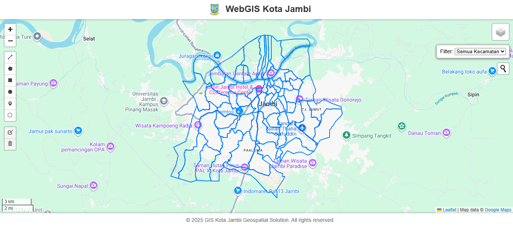

# 🌍 WebGIS Interaktif Kota Jambi - Platform Solusi Geospasial

### Proyek Resmi Pengembangan Peta Digital Kota Jambi Menggunakan Leaflet

Platform ini adalah Sistem Informasi Geografis berbasis web (**WebGIS**) yang dikembangkan khusus untuk memvisualisasikan data geospasial Kota Jambi secara interaktif. Tujuannya adalah menyediakan solusi peta digital yang ringan, cepat, dan fungsional untuk kebutuhan publik, edukasi, maupun profesional di bidang geospasial.

## ✨ Fitur Utama (Keywords: Peta, Fungsi, Kota Jambi)

Proyek **Peta WebGIS Jambi** ini dibangun dengan fokus pada kemudahan penggunaan dan fungsionalitas inti:

* **Peta Interaktif Penuh**: Navigasi dan eksplorasi wilayah **Kota Jambi** dengan mulus.
* **Pencarian Lokasi (Geocoding)**: Integrasi dengan layanan pencarian untuk menemukan alamat atau tempat penting di Jambi dengan cepat.
* **Alat Pengukuran**: Fitur untuk mengukur jarak dan luas area di atas peta.
* **Alat Gambar (Drawing)**: Kemampuan untuk membuat anotasi, menggambar fitur sementara, dan menandai area penting di Peta Jambi (**Leaflet.draw**).
* **Tampilan Responsif**: Antarmuka yang dioptimalkan untuk berbagai perangkat, baik desktop maupun mobile.

## 🛠️ Tumpukan Teknologi (Keywords: Leaflet, JavaScript, Library)

Proyek ini dibangun menggunakan teknologi *frontend* murni, menjamin kecepatan dan kemudahan akses:

* **HTML5, CSS3, dan JavaScript (ES6)**: Sebagai dasar pengembangan web.
* **Leaflet.js**: Pustaka JavaScript terkemuka dan ringan untuk peta interaktif.
* **Leaflet Draw**: Digunakan untuk fungsionalitas *drawing* dan pengukuran.
* **Leaflet Control Geocoder**: Untuk fitur pencarian alamat yang efisien.
* **Host**: Berjalan sepenuhnya di sisi klien (Static WebGIS).

## 🚀 Cara Menjalankan Proyek Secara Lokal

1.  **Clone Repository:**
    ```bash
    git clone [https://github.com/giskotajambi/leaflet-webgis-jambi-official.git](https://github.com/giskotajambi/leaflet-webgis-jambi-official.git)
    ```
2.  **Buka Folder:**
    ```bash
    cd leaflet-webgis-jambi-official
    ```
3.  **Jalankan:** Cukup buka berkas **`index.html`** di peramban web modern Anda. Tidak diperlukan *web server* lokal untuk *deployment* dasar.

---

## 📸 Tampilan Proyek (Screenshot/Demo)

*(Gambar ini menunjukkan antarmuka peta interaktif Kota Jambi yang responsif.)*



## ⚖️ Lisensi

Proyek ini dirilis di bawah **[Lisensi MIT](LICENSE)**.
