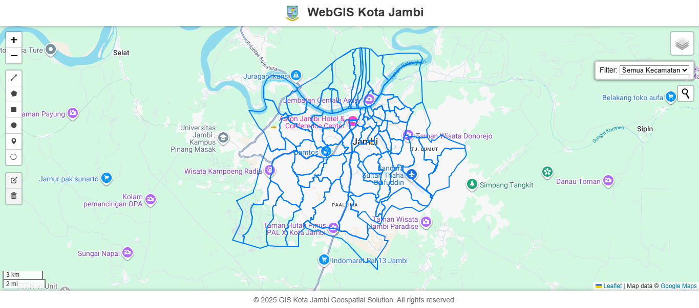

# 🌍 WebGIS Interaktif Kota Jambi - Platform Solusi Geospasial

### Proyek Resmi Pengembangan Peta Digital Kota Jambi Menggunakan Leaflet

[**▶️ KUNJUNGI APLIKASI WEBGIS LIVE DI SINI**](https://giskotajambi.github.io/leaflet-webgis-jambi-official/)

Platform ini adalah Sistem Informasi Geografis berbasis web (**WebGIS**) yang dikembangkan khusus untuk memvisualisasikan data geospasial Kota Jambi secara interaktif. Tujuannya adalah menyediakan solusi peta digital yang ringan, cepat, dan fungsional untuk kebutuhan publik, edukasi, maupun profesional di bidang geospasial. Proyek ini berfungsi sebagai sumber utama (*official source*) dari kode WebGIS berbasis **Leaflet** untuk wilayah Jambi.

---

## ⚠️ PEMBERITAHUAN HAK CIPTA & LISENSI

**© 2026 GIS Kota Jambi. Hak Cipta Dilindungi Undang-Undang (All Rights Reserved).**

Kode sumber (*source code*), desain, antarmuka, dan aset dalam repositori ini adalah properti eksklusif dari **GIS Kota Jambi**.

*   **DILARANG KERAS** menyalin, menduplikasi, memodifikasi, mendistribusikan, atau menggunakan kode ini untuk proyek lain (baik komersial maupun non-komersial) tanpa izin tertulis resmi dari pemilik hak cipta.
*   Repositori ini disediakan semata-mata untuk tujuan **transparansi publik** dan **referensi edukatif** bagi mahasiswa atau pengembang yang ingin mempelajari struktur implementasi WebGIS modern.
*   Melihat kode (*view only*) diperbolehkan untuk keperluan belajar, namun **mengambil dan menggunakannya kembali (*reuse*) adalah pelanggaran hak cipta**.
*   Pelanggaran terhadap ketentuan ini akan dikenakan tindakan hukum sesuai peraturan perundang-undangan yang berlaku.

---

## ✨ Fitur Utama

Proyek **Peta WebGIS Jambi** ini dibangun dengan fokus pada kemudahan penggunaan dan fungsionalitas inti:

*   **Peta Interaktif Penuh**: Navigasi dan eksplorasi wilayah **Kota Jambi** dengan mulus, menawarkan berbagai pilihan *basemap* global (Google Maps, OpenStreetMap).
*   **Pencarian Lokasi (Geocoding)**: Integrasi dengan layanan pencarian yang efisien (*Leaflet Control Geocoder*) untuk menemukan alamat atau tempat penting di Jambi dengan cepat.
*   **Alat Pengukuran Geospasial**: Menyediakan alat untuk menghitung jarak (**meter/kilometer**) dan luas area (**hektar/meter persegi**) secara langsung di atas peta.
*   **Alat Gambar (Drawing)**: Fitur *drawing* yang memanfaatkan **Leaflet.draw** untuk membuat anotasi, menggambar fitur sementara (poligon, garis, penanda), dan menandai area penting.
*   **Tampilan Responsif**: Antarmuka dioptimalkan untuk berbagai perangkat, baik desktop maupun mobile, memastikan pengalaman pengguna yang konsisten.
*   **Keamanan Data**: Mengimplementasikan *Row Level Security (RLS)* pada database dan kebijakan keamanan konten (CSP) untuk melindungi integritas data dan pengguna.

---

## 🛠️ Tumpukan Teknologi

Proyek ini dibangun menggunakan teknologi *frontend* murni, menjamin kecepatan dan kemudahan akses. Pustaka utama dimuat via CDN untuk efisiensi.

| Teknologi | Keterangan |
| :--- | :--- |
| **HTML5, CSS3, JavaScript (ES6)** | Dasar pengembangan *frontend* modern. |
| **Leaflet.js (v1.9.4)** | Pustaka JavaScript terkemuka dan ringan untuk peta interaktif. |
| **Leaflet Draw (v1.0.4)** | Ekstensi penting untuk fungsionalitas *drawing* dan pengukuran. |
| **Leaflet Control Geocoder** | Digunakan untuk fitur pencarian lokasi. |
| **Supabase** | Backend-as-a-Service untuk penyimpanan data spasial (PostgreSQL/PostGIS). |
| **Hosting** | Berjalan sepenuhnya di sisi klien (Static WebGIS) melalui **GitHub Pages**. |

---

## 🚀 Cara Menjalankan Proyek Secara Lokal (Referensi Edukatif)

Bagi peneliti, mahasiswa, atau pengembang yang ingin mempelajari struktur kode secara lokal untuk tujuan pendidikan:

1.  **Clone Repository:**
    ```bash
    git clone https://github.com/giskotajambi/leaflet-webgis-jambi-official.git
    ```
2.  **Buka Folder:**
    ```bash
    cd leaflet-webgis-jambi-official
    ```
3.  **Jalankan:**
    *   Cara termudah: Buka berkas **`index.html`** langsung di peramban web modern Anda.
    *   Cara disarankan: Gunakan ekstensi "Live Server" di VS Code untuk menghindari batasan CORS browser saat memuat modul ES6.

> **Catatan Penting:** Kode ini terhubung ke database produksi. Harap gunakan dengan bijak hanya untuk inspeksi kode dan jangan melakukan uji coba penulisan data (*write operations*) sembarangan yang dapat mengganggu integritas data.

---

## 📸 Tampilan Proyek

*(Gambar di bawah menunjukkan antarmuka peta interaktif Kota Jambi yang responsif dengan alat-alat pengukur dan pencarian yang aktif.)*



---

## ⚖️ Penyangkalan (Disclaimer)

Aplikasi ini disediakan "sebagaimana adanya" (*as is*) tanpa jaminan apapun, baik tersirat maupun tersurat. Pemilik proyek tidak bertanggung jawab atas kerugian atau kerusakan yang timbul akibat penggunaan data peta, ketidakakuratan informasi geospasial, atau kesalahan teknis yang mungkin terjadi. Data yang ditampilkan bersifat informatif dan tidak dapat digunakan sebagai dasar hukum sengketa lahan.

---

## 📬 Kontak & Izin Penggunaan

Untuk pertanyaan, laporan kesalahan, atau **permohonan izin penggunaan kode/licensing**, silakan hubungi tim pengembang melalui repositori ini atau saluran kontak resmi GIS Kota Jambi.
